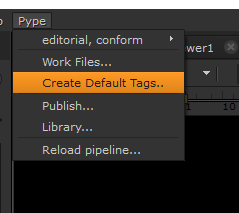
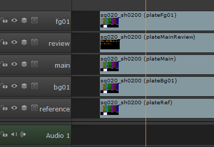
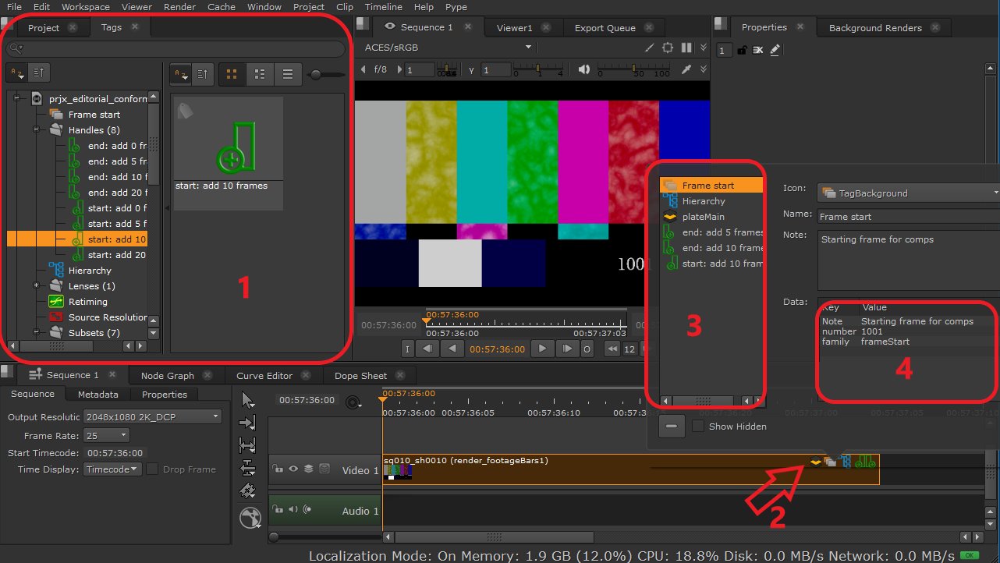
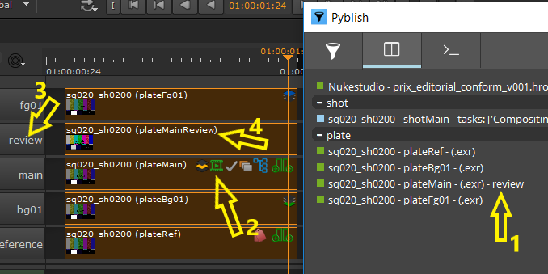
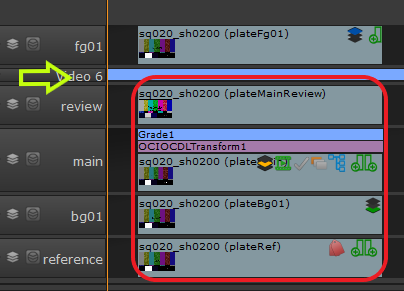
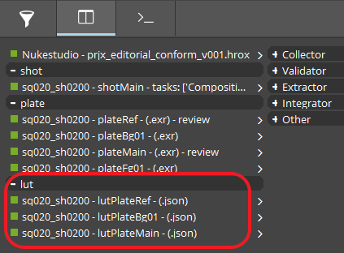

:::note
All the information also applies to **_Nuke Studio_**, but for simplicity we only refer to hiero. The workflows are identical for both. We are supporting versions **`11.0`** and above.
:::

:::tip Terminology
For mode details about the element click on its name.

[shot](artist_concepts.md#asset) - Shot object that will be created in the database or ftrack.

[subset](artist_concepts.md#subset) - a named clip on timeline tagged for publishing _foreground_, _main_, _background_, _reference_

[representation](artist_concepts.md#representation) - File type of a subset. A plate could for example be published as .exr sequence and .mov, these would be 2 representations

:::

## Hiero specific tools

### Create Default Tags

This tool will recreate all necessary pype tags needed for successful publishing. It is automatically ran at start of the hiero. Use this tool to manually re-create all the tags if you accidentaly delete them, or you want to reset them to default values.

#### Result

-   Will create tags in Tags bin in case there were none
-   Will set all tags to default values if they have been altered

## Publishing Shots

With Pype, you can use hiero as a starting point for creating project hierarchy in avalon and ftrack database (episodes, sequences, shots, folders etc.), publishing plates, reference quicktimes, audio and various soft effects that will be evailable later on for compositors and 3d artist to use.

There are two ways to `Publish` data and create shots in database from hiero. Use either context menu on right clicking selected clips or go to top `menu > Pype > Publish`.

Keep in mind that the publishing currently works on selected shots

Currently we **do not support encoding** on the fly during publishing so
all clips have to be previously encoded and cut to correct length.

Shot names for all the related plates that you want to publish (subsets) has to be the same to be correctly paired together (as it is shown in image).
Note the layer **review** which contains `plateMainReview`.
This media is just h264,1920x1080 video for tha will be used as preview of the actua `plateMain` subset and will be uploaded to Ftrack. We explain how to work with review tag in [**Reviewing**](#reviewing).

:::important
To to successfuly publish a shot from hiero:
1. At least one clip of your shot must be tagged with `Hierarchy`, `subset` and `handleStart/End`.
2. Your source media must be pre-cut to correct length (including handles)
:::

### Tagging

Pype's custom tags are used for defining shot parameters and to define which clips and how they are going to be published.

If you want to add any properties to your clips you'll need to adjust values on the given tag and then drag it onto the clip.

<figure>

<figcaption>

1.  double click on preferable tag and drag&drop it to selected clip(s)
2.  Basic set of tags on clip (usually subset: plateMain)
3.  Additionally select clip and edit its parameters
4.  Edit parameters here but Do not touch `family`

</figcaption>
</figure>

:::important
Only clips with `subset` will be directly processed for publishing.
:::

### Custom Tags Details

#### Asset related
| Icon                | Description                                                                        | Editable                              | Options                                                                                  |
| ------------------- | ---------------------------------------------------------------------------------- | ------------------------------------- | ---------------------------------------------------------------------------------------- |
| ![Hierarchy][hi]    | Define parent hierarchy of the shot. Usually combined with one of subset tags.     | root, folder, sequence, episode, shot | example: {sequence} = name of hiero sequence or overwrite by any text without `-` or `_` |
| ![Frame Start][fst] | Set start frame of the shot. Using `"source"` will keep original frame numbers.    | number                                | int `number` or `"source"`                                                                |

#### Subsets

| Icon               | Description                                                                    | Editable | Options                           |
| ------------------ | ------------------------------------------------------------------------------ | -------- | --------------------------------- |
| ![Review][rew]     | Choose which track holds review quicktime for the given shot.      | track    | `"review"` or other track name |
| ![Plate Main][pmn] | Main plate subset identifier                                       | subset   | `"main"` or other                 |
| ![Plate FG][pfg]   | Foreground plate subset identifier (comped over the main plate)    | subset   | `"Fg##"` or other                 |
| ![Plate BG][pbg]   | Background plate subset identifier (comped under the main plate)   | subset   | `"Bg##"` or other                 |
| ![Plate Ref][ref]  | Reference plate subset identifier                                  | subset   | `"Ref"`  or other                 |

#### Subset's attributes

| Icon               | Description                                                                | Editable            | Options                       |
| ------------------ | --------------------------------------------------------------------------------- | ------------------- | ----------------------------- |
| ![Resolution][rsl] | Use source resolution instead of sequence settings.                        | none                |                               |
| ![Retiming][rtm]   | Publish retime metadata to shot if retime or time-warp found on clip       | marginIn, marginOut | int `number` frame cushioning |
| ![Lens][lns]      | Specify lens focal length metadata (work in progress)                      | focalLengthMm       | int `number`                  |

#### Handles

| Icon                  | Description                                           | Editable | Options                    |
| --------------------- | ---------------------------------------------------------------------------- | -------- | -------------------------- |
| ![Handles Start][ahs] | Handles at the start of the clip/shot                 | value    | change to any int `number` |
| ![Handles End][ahe]   | Handles at the end of a clip/shot                     | value    | change to any int `number` |

[hi]: assets/nks_icons/hierarchy.png

[ahs]: assets/nks_icons/3_add_handles_start.png

[ahe]: assets/nks_icons/1_add_handles_end.png

[rsl]: assets/nks_icons/resolution.png

[rtm]: assets/nks_icons/retiming.png

[rew]: assets/nks_icons/review.png

[pmn]: assets/nks_icons/z_layer_main.png

[pfg]: assets/nks_icons/z_layer_fg.png

[pbg]: assets/nks_icons/z_layer_bg.png

[lns]: assets/nks_icons/lense1.png

[fst]: assets/nks_icons/frame_start.png

[ref]: assets/nks_icons/reference.png

### Handles

Pype requires handle information in shot metadata even if they are set to 0.
For this you need to add handles tags to the main clip (Should be the one with Hierarchy tag).
This way we are defining a shot property. In case you wish to have different
handles on other subsets (e.g. when plateBG is longer than plateFG) you can add handle tags with different value to this longer plate.

If you wish to have different handles length (say 100) than one of the default tags, simply drag `start: add 10 frames` to your clip
and then go to clips tags, find the tag, then replace 10 for 100 in name and also change value to 100.
This is also explained following tutorial [`Extending premade handles tags`](#extending-premade-handles-tags)

:::caution
Even if you don't need any handles you have to add `start: add 0 frames` and `end: add 0 frames` tags to the clip with Hierarchy tag.
:::

### Retiming

Pype is also able to publish retiming parameters into the database.
Any clip with **editorial**/**retime** or **TimeWarp** soft effect has to be tagged with `Retiming` tag, if you want this information preserved during publishing.

Any animation on **TimeWarp** is also preserved and reapplied in _Nuke_.

You can only combine **retime** and with a single **Timewarp**.

### Reviewing

:::neutral There are two ways to publish reviewable h264 mov into Pype (and ftrack).
<!--DOCUSAURUS_CODE_TABS-->

<!--Using Review Tag-->

The first one uses the Review Tag pointing to the track that holds the reviewable quicktimes for plates.

This tag metadata has `track` key inside that points to `review` track by default. If you drop this tag onto any publishable clip on the timeline you're  telling pype "you will find quicktime version of this plate on `review` track (clips must have the same name)"

In the image on the right we dropped it to **plateMain** clip. Then we renamed the layer tha hold reviewable quicktime called `plateMainReview`. YOu can see that the clip names are the same.

<figure>

<figcaption>

1.  `- review` suffix is added to publishing item label if any reviewable file is found
2.  `plateMain` clip is holding the Review tag
3.  layer name is `review` as it is used as default in _Review_ Tag in _track_
4.  name of clip is the same across all subsets

</figcaption>
</figure>

<!--Using Sidecar Quicktime-->

Second way would be to add the **h264 mov 1920x1080** into the same folder
as image sequence. The name of the file has to be the same as image sequence.
Publisher will pick this file up and add it to the files list during collecting.
This will also add `"- review"` to instance label in **Publish**.

Example:

-   img seq: `image_sequence_name.0001.exr`
-   mov: `image_sequence_name.mov`

<!--END_DOCUSAURUS_CODE_TABS-->

:::

--------------

### LUT Workflow

It is possible to publish hiero soft effects for compositors to use later on. You can add the effect to a particular clip or to whole layer as shows on the picture. All clips
below the `Video 6` layer (green arrow) will be published with the **lut** subset which combines all the colour corrections from he soft effects. Any clips above the `Video 6` layer will have no **lut** published with them.  

Any external Lut files used in the soft effects will be copied over to `resources` of the published subset folder `lutPlateMain` (in our example).

:::note

You cannot currently publish soft effects on their own because at the moment we only support soft effects as a part of other subset publishing. Image is demonstrating successful publishing.

:::

## Tutorials

### Basic publishing with soft effects

<iframe src="https://drive.google.com/file/d/1-BN6ia9ic9om69mq3T4jiwZnbrBGdyNi/preview"></iframe>

### Extending premade handles tags

<iframe src="https://drive.google.com/file/d/1-BexenWWmSURA-QFgxkoZtyxMEhZHOLr/preview"></iframe>

